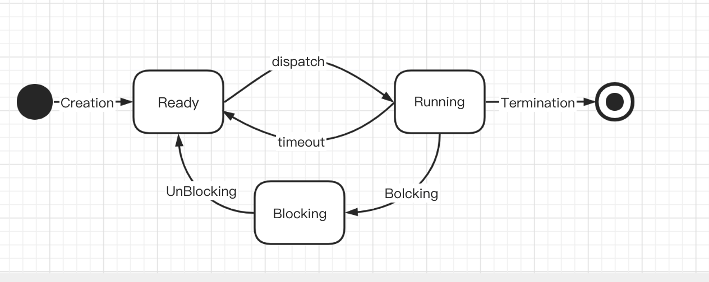
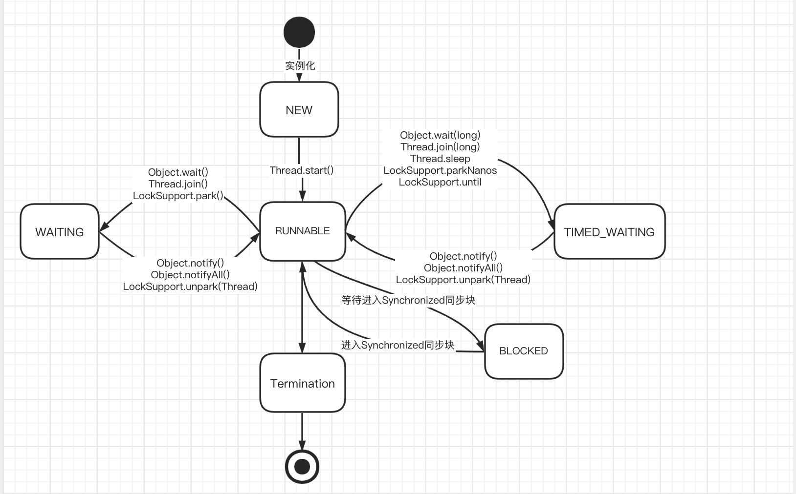

## Java线程池一：线程基础

最近精读Netty源码,读到NioEventLoop部分的时候，发现对Java线程&线程池有些概念还有困惑， 所以深入总结一下

### 线程创建

Java线程创建主要有三种方式：继承Thread类、实现Runable接口、实现Callable接口

只有通过调用``Thread.start()`` 方法才会真正创建一个线程， 调用``Thread.run()`` 并不会

当调用线程关心任务执行结果时，我们应选择实现Callable接口的方式创建线程

- 继承方式实现创建线程

  ```java
  @Test
  public void testCreate_1() {
    Thread t = new Thread() {
      @Override
      public void run() {
        System.out.println(Thread.currentThread().getName());
        throw new RuntimeException();
      }
    };
    t.start();
    t.run();
  }
  ```

- 实现Runnable接口的方式创建线程，这种方式调用线程无法感知任务线程执行结果（是否执行、成功或者异常）

  ```java
  @Test
  public void testCreate_2() {
    Thread t = new Thread(() -> System.out.println(Thread.currentThread().getName()));
    t.start();
  }
  ```

  

- 实现Callable接口，调用线程通过FutureTask对象获取执行结果（返回值或者异常）

  ```java
  @Test
  public void testCreate_3() throws ExecutionException, InterruptedException {
    FutureTask<Integer> task = new FutureTask<>(() -> {
      throw new RuntimeException();
    });
    new Thread(task).start();
    System.out.println(task.get());
  }
  ```

### 线程的状态

我们知道Java线程是使用系统内核线程实现， 所以先来简单回顾下系统内核线程的状态

#### 内核线程的状态

- Ready状态：当前线程已经就绪，等待系统调度
- Running状态：当Ready状态的线程分配到时间片后进入该状态
- Blocking状态：运行中的线程因为其他资源未就绪进入该状态



#### Java线程的状态

- NEW: 实例化一个Thread对象后未调用start方法前都是该状态
- RUNNABLE: JVM里面的可执行状态，对应内核线程的Ready或者Running状态。所以该状态下线程不一定在在运行，有可能在等待调度
- WAITING： 等待状态，需要其他线程唤醒后才能重新进入RUNNABLE状态
- TIMED_WAITING：超时等待，等待一定的时间或者被其他线程唤醒之后可再进入RUNNABLE状态
- BLOCKED：阻塞状态，特指等待进入synchronized同步块的状态（获取监视器锁）
- Termination：终态

只有待获取监视器锁时才是阻塞状态，获取Java语言实现的锁（ReentrantLock等)是等待状态。二者的区别在于监视器锁的实现依赖内核变量。



### 异常处理

假设一段业务逻辑没有考虑运行时异常， 而运行时异常又刚好发生了，那么对应的线程就会直接崩溃。所以多线程环境下为了让程序更加健壮稳定， 我们需要捕获异常。

- 将整个业务逻辑加上异常捕获（当然代码就不是很优雅）

  ```java
  @Test
  public void testExceptionHandle_1() {
    new Thread(() -> {
      try {
        //business code
        int a = 1, b = 0;
        a = a / b;
      } catch (Throwable th) {
        //log
      }
    }).start();
  }
  ```

  

- 使用FutureTask异步回掉处理异常(更加优雅，业务逻辑和异常处理逻辑分离)

  ```java
  @Test
  public void testExceptionHandle_2() {
    //业务逻辑
    FutureTask<Integer> ft = new FutureTask<>(() -> {
    //business code
    int a = 1, b = 0;
    a = a / b;
    return a;
    });
  
    Thread t = new Thread(() -> {
    ft.run();
    handleResult(ft);
    });
    t.start();
  }
  //异常处理逻辑
  private void handleResult(FutureTask<Integer> ft) {
      try {
      System.out.println("the result is " + ft.get());
      } catch (InterruptedException e) {
      //log or ...
      e.printStackTrace();
      } catch (ExecutionException e) {
      //log or ...
      e.printStackTrace();
      }
  }
  ```

### 中断

Java中断是一种线程间通信手段。比如A线程给B线程发送一个中断信号，B线程收到这个信号，可以处理也可以不处理。

- 中断相关的API

```java
void thread.interrupt();//实例方法-中断线程（线程的中断标识位置为1）
boolean thread.isInterrupted();//线程是否中断 & 不清除中断标识
static boolean Thread.interrupted();//当前线程是否中断 & 清除中断标识
```

- 实例

  线程t_1每次循环会判断当前线程的中断状态，如果当前线程已经被中断（中断标识位为1）就直接返回；

  整个通信过程：主线程把t_1线程的中断标识位置为1，t_1获取到中断标识位为1， 然后结束循环。

  ```java
  @Test
  public void testInterrupt() throws InterruptedException {
    Thread t_1 = new Thread(() -> {
      int i = 0;
      while (true) {
        boolean isInterrupt = Thread.interrupted();
        if (isInterrupt) {
          System.out.println("i am interrupt, return");
          return;
        }
        //business code
        if (i++ % 10000 == 0) {
          System.out.println(i);
        }
      }
    });
    t_1.start();
    for (int i = 0; i < 100000; i++) {
      ;
    }
    t_1.interrupt();
  }
  ```

### 其他

 - 守护线程

   当JVM中的所有的用户线程都退出后守护线程也会退出

- 优先级

  线程的优先级越高，越有可能更快的执行或者获得更多的可执行时间单元。但是Java线程的优先级只是参考，依赖于具体的实现

- thread.join()

  调用线程进入WAITING状态，直到thread线程终止

- thread.yield()

  当前线程让出cpu资源，仍处于RUNNABLE状态

  

  

  

  
