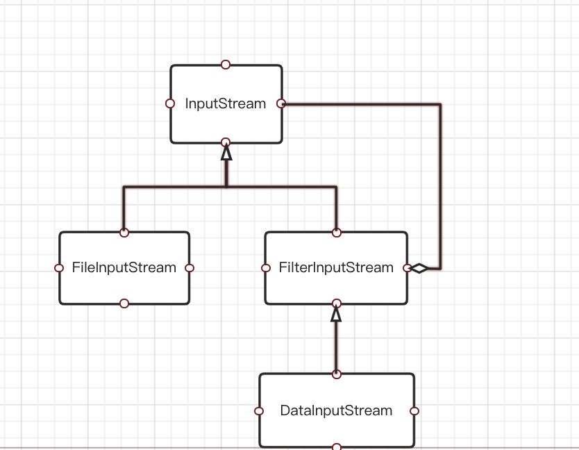

最近打算把Java网络编程相关的知识深入一下（IO、NIO、Socket编程、Netty)

Java的I/O建立于流之上。输入流读取数据、输出流写入数据

## 输入输出流

### 输入流

输入流InputStream的API如下：

```java
public abstract int read() throws IOException;//-1 到 255
public int read(byte b[]) throws IOException 
public int read(byte b[], int off, int len) throws IOException
public long skip(long n) throws IOException
public int available() throws IOException
public void close() throws IOException 
```

read()方法返回的实际上是一个无符号byte(Java中没有无符号byte类型, 就直接用int作为返回值了)

read方法返回-1时代表已经读完数据（如果是网络通信的话就代表对端不会再发送数据）

### 输出流

输出流OutputStreamAPI如下：

```java
// OutputStream接口定义的几个方法
public abstract void write(int b) throws IOException;
public void write(byte b[]) throws IOException 
public void write(byte b[], int off, int len) throws IOException
public void flush() throws IOException
public void close() throws IOException
```

write(int) 方法实际写入的是int的低8位（一个字节）

尽量不要使用write(int), 因为每次发送一个字节效率不高（每个TCP报文都至少有40个字节的网络传输开销， 每次传输数据太少的话信道利用率不高）

flush() 将缓冲区中的内容刷到底层输出流

### 关闭流

流对应了底层的文件句柄和端口， 所以使用完成之后一定要关闭

下面是常见的一种关闭流的写法（把流的关闭放在finally语句块中），但是可太复杂了！！！

```java
	FileInputStream in = null;
  try {
    in = new FileInputStream("/tmp/axt.t");
    //
  } catch (FileNotFoundException e) {
    //
  } finally {
    if (in != null){
      try {
        in.close();
      } catch (IOException e) {
        //
      }
    }
  }
```

简洁一些的写法

```java
try(FileInputStream in = new FileInputStream("/tmp/a.txt")){
   // do somethind
} catch (Exception e) {
   //
}

```

因为Java会对try块中申明的所有AutoCloseable类型的对象自动调用close()方法,不需要手动调用！

## 过滤器流

过滤器流实际上是对流功能的增强，使用的是装饰模式。

### 装饰模式

装饰模式就是在原有的基础上增加了一些新的功能，通过组合实现。

下为过滤器流类结构--装饰模式的体现



### 过滤器流的作用

下面这段代码对FileInputStream 使用了 BufferedInputStream 和 DataInputStream 进行包裹

使得用户可以直接读取字符， 且是从Java缓冲区中获取（如果缓冲中没有可用数据，再尝试从底层输入流读取）

```
FileInputStream in = new FileOutputStream("/tmp/a.txt");
in = new BufferedInputStream(in);
in = new DataInputStream(in);
in.readChar();
```

过滤器流还可以实现解压（ZIPInputStream)、Base64解码（Base64InputStream)等，也可以自定义过滤器流以实现特定功能）

### 缓冲流

缓冲流作为过滤器流中的一种， 在网络通信场景下使用缓冲有利于提升发送和接受数据的效率。

所以在发送数据时我们应该使用BufferedOutputStream， 这样写数据时会先写入到java的缓冲区中， 缓冲区满或者调用flush方法时才会真正的发送数据，能够提升性能（提升信道利用率）

```java
 OutputStream out = new FileOutputStream("/tmp/a.txt");
 BufferedOutputStream outputStream = new BufferedOutputStream(out);
 out.write(1);
 out.flush();
```


### 数据流

缓冲流作为过滤器流中的一种，提供直接读写Java基本类型的API

```java
 OutputStream out = new FileOutputStream("/tmp/a.txt");
 DataOutputStream  dataOutputStream = new DataOutputStream(out);
 dataOutputStream.writeChar('c'); //写字符
 dataOutputStream.writeUTF("ssss"); //写字符串
```

## 阅读器和书写器

提供读写字符的API（如果只是ASCII编码， 直接使用字节流即可）

### 书写器

OutputStreamWriter 提供直接读取字符和字符串的能力

```java
OutputStream out = new FileOutputStream("/tmp/a.txt"); //底层字节流
Writer writer = new OutputStreamWriter(out, StandardCharsets.UTF_8);
writer.write("哈哈哈");
```

### 缓冲书写器 

BufferedWriter 提供一层写缓冲（作用类同字节流的BufferedOutputStream)

### Demo

```java
 				OutputStream out = new FileOutputStream("/tmp/a.txt"); //底层字节流
        Writer writer = new OutputStreamWriter(out, StandardCharsets.UTF_8);//书写器（编码）
        writer = new BufferedWriter(writer, 1000);//缓冲书写器
        for (int i = 0; i < 128; i ++){
            writer.write(i); 
        }
        writer.write("哈哈哈哈哈");//写汉字， utf-8编码可见，如果是ascii编码会乱码
        writer.flush(); //这里其实不用flush, close之前会flush，但是最好有。
        writer.close(); //close流， 释放底层资源。

```


## 总结

总体分成两类 字节流 和字符流， 字符流是仅对字节流的装饰（或者说字符流的底层就是字节流）

过滤器流：对基础流增加一些额外的功能 如果缓冲、压缩、加密等

缓冲流：读写数据中间加一层缓冲区，提升数据传输效率。


