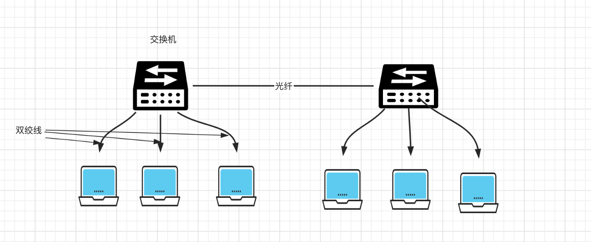
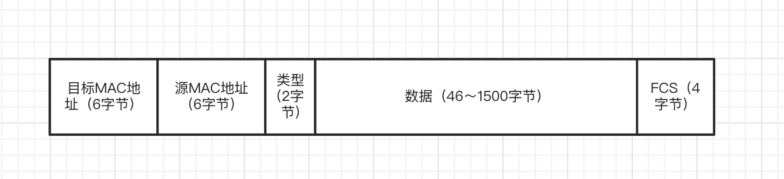

物理层负责把计算机中的0、1数字信号转换为具体传输媒介的物理信号（电压的高低、电波的强弱、光的闪灭）

数据链路层协议定义了(通过通信介质互连的设备间的)数据传输规范 （常见的通信介质有同轴电缆、双绞线电缆、光纤、电波）

## 相关技术

### MAC地址

数据链路层机器节点的标识，无论是哪种数据链路的网络（如以太网，蓝牙等)，等不会有相同的MAC地址

6字节（48比特）

### 共享介质型网络

共享介质型网络指多个设备共享一个通信介质的一种网络。

多个设备之间使用同一个载波信道进行数据的发送和接受,  这样当一个设备在发送或者接受数据的时候其他设备就只能排队等待。

基本为半双工通信【全双工通信指可以同时进行数据的发送和接受， 而半双工不行】

#### 介质访问控制方式

共享型网络是共享通信信道的， 当一个设备使用的时候其他设备不能再进行数据传输，所以就需要对传输通道的使用进行控制

主要有：争用方式 和 令牌传递两种介质访问控制方式

##### 争用方式（先到先得）

  也叫CSMA/CD（载波监听多路访问/冲突检测） 

  算法如下：

  当信道上没有数据传输时，所有的站点都可以发送数据帧

  当发生冲突时，放弃发送数据帧， 同时立即释放信道

  放弃发送后，随机等待一段时间，再重新争用信道，重新发送帧。（随机等待一段时间避免再次发送数据时也产生冲突）

##### 令牌传递方式

  令牌沿着整个网络环传递， 只有获得令牌之后才能发送数据帧。

  因为同一时刻只会有一个设备获得令牌， 所以可以保证不会冲突。

  但是信道的利用率不会太高（因为即使此刻没有其他设备在传送数据帧，也需要等令牌传递到当前设备才可以发送数据 ）

### 非共享介质型网络

  网络中的每个站点直接与交换机端口连接，所以发送方和接收方是不共享传输介质的

  可以实现全双工通信

### 集线器（Hub)

  Hub工作在物理层，对接受到的信号进行整形扩大 以扩大网络的传输距离。
  它不具有类似交换机的MAC地址表，所以会把数据广播到所有与之相连的节点。

### 交换机

交换机工作在数据链路层或者网络层（有路由功能）

#### MAC地址转换表自我学习过程

  交换机收到某站点数据帧时，如果源地址和端口不在转换表中就将源地址和端口写到转换表中

  然后在转换表中查找目标MAC地址。

  如果找到就把数据帧转发到该端口，否则广播到所有端口。

#### 转发方式

有存储转发和直接转发两种方式：

存储转发会校验数据帧的FCS字段 如果检测到帧已经损坏就直接丢弃

直通转发在知道MAC地址之后就开始转发，不校验数据帧

直通转发延迟会更低。

### 环路检测技术

 如果网络成环，数据帧就可能在环中一而再再而三的转发，然后造成网络瘫痪。

 有生成树和源路由两种算法：

  生成树方式：通过禁用某些端口 将整个网络构成为一棵树，避免成环。

  源路由算法：将发送帧的源网桥MAC地址写入数据帧中

### VLAN(虚拟局域网)

  把交换机根据端口分成多个网段，从而区分了广播数据传播的范围

  减少了网络的负载并提供了网络的安全性 

  当然这样整个网络就有多个网段， 需要利用有路由功能的交换机（L3) 或者路由器连接多个网段

## 以太网（IEEE802.3）

  以太网是一种计算机局域网技术

  在网络普及的时候， 多台终端使用同一根同轴电缆的共享介质型的连接方式。

  而现在一般采用终端与交换机之间独占电缆的方式实现以太网通信（如下图）

### 以太网帧

前导码 + 帧体

以太网帧前端有一个前导码的部分， 表示一个以太网帧的开始， 用于与对端网卡进行同步（对齐）

帧体：

6字节目标MAC地址：用于数据链路层寻址（交换机查找转发端口）

类型：上层协议类型（IP等协议）

FCS（帧校验序列）：用于check帧在传输过程是否遭到破坏

#### MTU = 1500 

从信道利用率和传输时间两方面考虑，以太网的数据传输范围被限制为(46~1500字节)

信道利用率: 假设实际传输数据X字节，利用率就是X/(X + 18)【实际数据字节数/整个帧字节数， 18是帧头14字节 + 帧尾4字节FCS】, X越大信道利用率就越高

数据最少为46字节： 取46的时候信道利用率为71%[46 / (46 + 18)] ，利用率不会太低（当然还有其他原因）

数据最大为1500字节：

我们知道传输的数据越大， 传输时间就越长

假设100Mbps的网络， 网络层的数据报最大65535字节时数据传输时间就是 65535 / (100 * 1024 *1024 / 8) * 1000 = 4.99ms

如果是共享介质型网络，在这5ms内自己不能接受数据，其他设备不能接受发送数据，不可接受！！！

所以我们需要在链路层对上层数据报进行拆分，1500字节的数据在100Mbps的网络下， 传输时间只需要0.11ms左右，是OK 的。

  

  